# ПЗРК Летучка 4

1. **Определение ЗУР. Перечислить составные части и их назначение**
   
   <mark>Зенитная управляемая ракета</mark> - боевой реактивный беспилотный управляемый крылатый летательный аппарат (ЛА), предназначенный для поражения целей.
   
   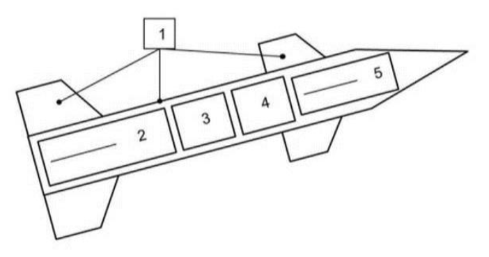
   
   Составные части:
   
   1. <mark>Планер</mark> - несущая конструкция, размещающая внутри себя аппаратуру ракеты и создающая аэродинамические силы.
   
   2. <mark>Двигательная установка</mark> - система ракеты, обеспечивающая её движение в пространстве.
   
   3. <mark>Энергосистема</mark> - система ракеты, обеспечивающая энергией все бортовые системы ракеты.
   
   4. <mark>Боевое снаряжение</mark> - совокупность взаимосвязанных приборов и устройств, обеспечивающих поражение цели за счет подрыва боевой части ракеты.
   
   5. <mark>Бортовая аппаратура управления (БАУ)</mark> - совокупность взаимосвязанных приборов и устройств, обеспечивающих реализацию заданных режимов функционирования в процессе предстартовой подготовки, пуска и управления полётом.

2. **Раскрыть ТТХ ЗУР**
   
   1. <mark>Боевая дальность</mark> - диапазон дальностей, в пределах которого ракета способна поражать цель
   
   2. <mark>Диапазон боевых высот</mark> - диапазон высот, в пределах которого ракета способна поражать цель
   
   3. <mark>Скорость полета</mark> - диапазон скоростей, в пределах которого ракета способна поражать цель
   
   4. <mark>Располагаемые перегрузки</mark> - нормальные перегрузки, которые можно получить на ракете при максимальном отклонении её рулей
   
   5. <mark>Потребные перегрузки</mark> - перегрузки, необходимые для удержания ракеты на кинематической траектории при стрельбе по маневрирующей щели

3. **Перечислить системы координат, раскрыть подробно *прямоугольную и параметрическую***
   
   - <mark>Прямоугольная</mark> - используется при решении задач взаимного ориентирования боевых средств ПВО при развёртывании комплекса на позиции, передачи данных целеуказания с пункта управления на огневые средства и при машинных расчётах координат точки
     
     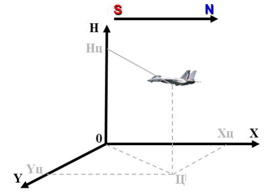
   
   - <mark>Сферическая (полярная)</mark> - используется для определения пространственного положения объекта с помощью РЛС обнаружения
     
     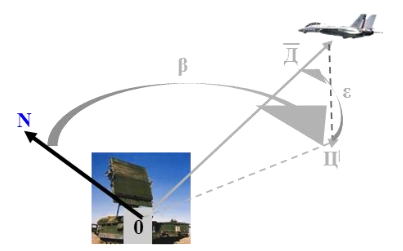
     
     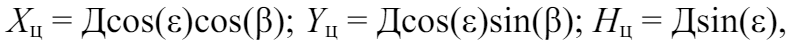
     
     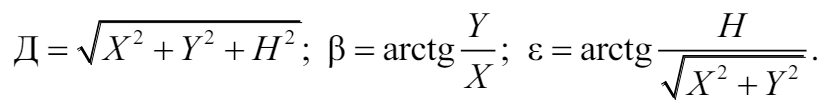
   
   - <mark>Параметрическая</mark> - используется для расчёта зон поражения и пуска
     
     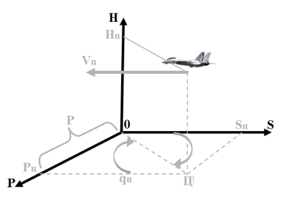
     
     Р - курсовой параметр
     
     $q_ц$ - курсовой угол цели (0-90 - приближение, иначе удаление)
   
   - <mark>Связанная</mark> используется в теории полёта для описания положения ЗУР относительно пункта управления полётом, а также при анализе действия сил и моментов
     
     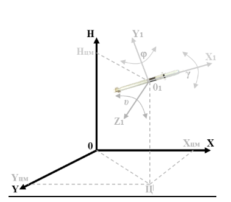
     
     $v$ - угол тангажа
     
     $\phi$ - угол курса
     
     $\gamma$ - угол крена
   
   - <mark>Скоростная</mark> - используется в теории полёта при анализе явлений обтекания ЗУР воздушным потоком
     
     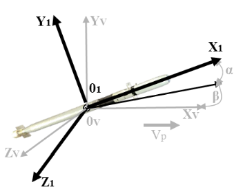
     
     $\alpha$ - угол атаки
     
     $\beta$ - угол скольжения

4. **Перечислить аэродинамические схемы ЗУР, раскрыть подробно форму *утка***
   
   
   
   <mark>Утка</mark>
   
   Плюсы
   
   - Маневр осуществляется практически без изменения углов атаки корпуса
   
   - Возможность применения прямоточных воздушно-реактивных двигателей
   
   - Удобство компоновки бортовой аппаратуры для систем ЗУР с самонаведением
   
   Минусы
   
   - Обязательны большие стабилизаторы с элеронами
   
   - Большая мощность крыльевых приводов
   
   - Не используется подъемная сила корпуса

5. **Перечислить методы наведения в системах с самонаведением. Раскрыть метод *пропорционального сближения***
   
   - <mark>Метод погони</mark> - во время наведения вектор скорости ракеты направлен на цель
     
     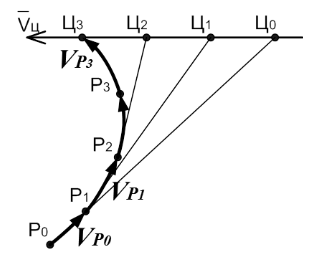
     
     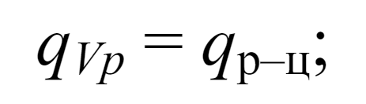
   
   - <mark>Метод параллельного сближения</mark> - во время наведения положение линии *ракета-цель* должно быть параллельным своему первоначальному положению
     
     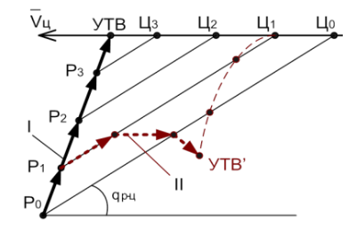
     
     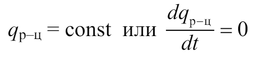
   
   - <mark>Метод пропорционального сближения</mark> - во время наведения угловая скорость вращения вектора скорости ракеты должна быть пропорциональна угловой скорости вращения линии *ракета-цель*
     
     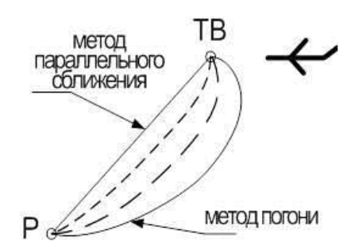
     
     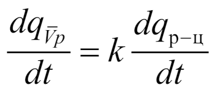
     
     $k=1:$ метод погони
     
     $k=\infty:$ метод параллельного сближения

6. **Состав Боевого снаряжения (состав, назначение составных частей)**
   
   - <mark>Взрыватель</mark> - взрыватель формирует команды на подрыв БЧ, когда обеспечивается максимальная вероятность поражения цели (контактные и бесконтактные)
   
   - <mark>Предохранительно-исполнительный механизм (ПИМ)</mark> - обеспечивает: 1) преобразование сигнала срабатывания взрывателя в детонационный импульс, инициирующий взрыв БЧ; 2) безопасность в обслуживании; 3) самоликвидацию ракеты в случае потери цели
   
   - <mark>Боевая часть</mark> - создает область поражения вокруг ракеты, при нахождении в которой обеспечивается гарантированное уничтожение цели

7. **ИК излучение (с. 71-72). Общие положения, схема ИК, достоинства и недостатки.**
   
   Каждое тело, температура которого выше абсолютного нуля, излучает.
   
   Весь ИК-диапазон волн принято делить на три участка:
   
   - коротковолновой - 0.75...1.4 мкм
   
   - средневолновой - 1.4...3 мкм
   
   - длинноволновой - 3...1000 мкм
   
   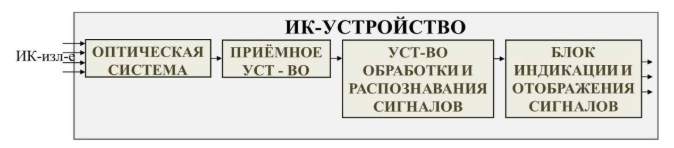
   
   **Плюсы**
   
   - ИК излучение является носителем обширной информации благодаря тепловому излучению разведываемых объектов
   
   - Наблюдение на расстоянии можно вести в принципе за любым, температура которого больше абсолютного нуля
   
   - Цели могут быть обнаружены при очень маленькой разнице температуры с фоном (0.01 Сo)
   
   - Можно обнаруживать и опознавать цели почти в абсолютной темноте
   
   - Приемлемая стоимость аппаратуры
   
   - Высокая помехоустойчивость
   
   - Наблюдение можно вести в любых условиях
   
   **Минусы**
   
   - ИК-приборы невозможно использовать при наличии густых туманов и облачности
   
   - Имеются трудности в опознавании целей на фоне окружающих объектов, действующих как помехи
   
   - Их одного пункта расстояние до источника ИК-излучения определить нельзя
