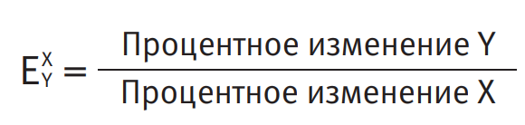

# Economy

## Конспект - Мария Бойко "Азы экономики"

--- 

##### Глава 1. Введение

**Экономика**- это наука о том, каким образом люди взаимодействуют друг с другом в процессе производства и распределения того, что они потребляют

**Основные предпосылки эконоической науки**

- Ресурсы ограничены, а потребности безрганичны

- Люди рациональны (не в прямом смысле этого слова)

**Экономические агенты** - это люди, домохозяйства, фирмы, государственные органы, принимающие участие в производстве и распределении

**Эффективное распределение ресурсов** - распределение ресурсов, при котором минусы от любого изменения сложившейся ситуации перевешивают плюсы

##### Глава 2. Производственные возможности

**Производственные возможности** - все наборы благ, которые могу быть произведены в данной стране, исходя из имеющихся в ее распоряжении ресурсов и технологий

**Граница производственных возможностей (ГПВ)** - совокупность таких наборов благ, которые могут быть произведены в стране за период времени и при производстве которых не остается свободных ресурсов

**Доступные наборы благ** - наборы благ, которые страна может произвести, иходя из имеющихся у нее ресурсов и технологий

**Недоступные наборы благ** - наборы благ, которыестрана не в состоянии произвести

**Эффективные наборы благ** - доступные наборы благ, при производстве которых не остается свободных ресурсов

**Неэффективные наборы благ** - доступные наборы благ, при производстве которых остаются свободные ресурсы

На рисунке:

- А, Б, В, Г - доступные наборы благ

- Д - недоступные наборы благ

- А, В, Б - эффективные наборы благ

- Г - неэффективные наборы благ

**Альтернативные издержки** - максимум того, что можно было бы получить при альтернативном использовании ресурсов, затраченных на производство данного блага

Чем меньше угол, под которым ГПВ пересекает ось некоторого товара, тем этот товар "дешевле", а чем больше, тем он "дороже" относительно другого товара

**Закон снижающейся предельной производительности ресурсов**: *По мере увеличения производства товара альтернативные издержки на его производство возрастают*

**Как увеличить производственные возможности?**

- Увеличение количества ресурсов

- Совершенствование технологии использования имеющихся ресурсов

- Совершенствование общественных институтов

- Специалищация и использование международного разделения труда

##### Глава 3. Обмен

*Свободный обмен благами между любьми увеличивает благосостояние каждого из них*

**Сравнительное преимущество** - способность производить товар с меньшими альтернативными издержками на единицу товара

**Абсолютное преимущество** - способность производить товар с меньшей затратой ресурсов на единицу товара

**Протекционизм** - политика, направленная на защиту внутренних производителей от внешней конкуренции

**Транзакционные издержки** - издержки, необходимые для совершения сделки

**Условия существования торговли**

- Альтернативные издержки производства благ, которыми собираются обмениваться участники торговли, должны быть различными у разных сторон

- Транзакционные издержки на совершение сделки не должны превышать выигрыш от торговли

##### Глава 4. Рынок

**Рынок какого-либо товара** - совокупность покупателей и продавцов данного товара

**Равновесная цена** - это такая цена, при которой количество товара, которое хотят приобрести покупатели, равно количеству этого товара, которо предлагают продавцы

**Дефицит** - превышение количества товара, которое при сложившейся цене хотят купатели

 **Избыток товара (профицит)** - превышение количества товара, которое при сложившейся цене хотят продать продавцы, над тем его количеством, которое по данной цене хотят купить покупатели

**Величина спроса на товар по цене Х** - это максимальное количество данного товара, кторое потребители согласны приобрести по цене Х

**Спрос на товар** - совокупность цен и соответствующих им величин спроса

**Закон спроса** - отрицательная зависимость между ценой товара и величиной спроса (искл. Товары Гиффена)

**Закон убывающей предельной полезности** - уменьшение дополнительной полезности для потребителя (удовлетворения потребителя) от каждой следующей единицы блага, которую он потребляет:

Зависимость количества товара, которое хотят купить, от цены:

Зависимость кривой спроса от внешних факторов:

**Внешние факторы:**

- Предпочтения

- Цена товаров-заменителей

- Цена дополняющих товаров

- Изменение дохода

**Товары-заменители (товары-субституты)** - товары, которые могут замещать друг друга в потреблении

**Дополняющие товары (товары-комплементы)** - товары, которые потребляются совместно друг с другом

**Нормальные товары** - это такие товары, спрос на которые растет при увеличении дохода потребителей и снижается при уменьшении их дохода

**Инфериорные товары (товары низкого качества)** - товары, спрос на которые снижается при росте дохода потребителей и растет при его падении

**Товары роскоши** - это нормальные товары, доля которых в потреблении растет вместе с ростом дохода и падает вместе с его сокращением

**Товары первой необходимости** - это нормальные товары, доля которых в потреблении падает вместе с ростом дохода и растет с его уменьшением

##### Глава 5. Предложение и издержки

**Величина предложения на твар при цене Х** - это максимальное количество товара, которое продавцы согласны продать по цене Х

**Предложение товара** - это совокупность цен и соответствующих им величин предложения

**Явные или бухгалтерские издержки** - те издержки, которые могут быть зафиксированы в бухгалтерской отчетности

**Неявные издержки** - альтернативные издержки, которые не могут быт в явном виде зафиксированы в бухгалтерской отчетности

**Экономические издержки** - альтернативные будущие издержки. Экономические издержки включают в сея как явные, так и неявные издержки

**Невозвратные издержки** - те издержки, которые уже понесены и не могут измениться вследствие наших решений

**Закон предложения** - увеличение величины предложения товара продавцом в ответ на увеличение его цены

Предложение растет:

Предложение падает:

##### Глава 6. Модель спроса и предложения. Рыночное равновесие

**Рыночное равновесие** - такое сочетание цены товара и его количества, при котором спрос и предложения совпадают

**Эффективное количество товара на рынке** - такое количество товара, продаваемое на рынке, любое изменение которого ведет к ухудшению благосостояния общества в целом, так как минусы от этого изменения превышают плюсы

**Задачи построения налоговой системы:**

- Собрать необходимые для государства средства и сделать это как можно дешевле

- Справедливо, с точки зрения общества, распределить тяжесть налогового бремени на граждан страны

- Минимизировать изменение стимулов экономических агентов в области производства и потребления

**Потоварный налог** - некая сумма, которой государство облагает каждую единицу товара, проданную на рынке

**Налоговое бремя экономического агента** - сумма налога, которая ложится на плечи данного экономического агента

**Влияние налога:**

##### Глава 7. Загадочное понятие "ЭЛАСТИЧНОСТЬ"

**Эластичность переменной Y по переменной Х** - процентное изменение переменной Y в ответ на один процент изменения переменной X.

Вычисление:

**Эластичность спроса по цене** - показывает на сколько процентов изменится величина спроса в ответ на изменение цены товара на один процент

**Эластичный спрос** - спрос, модуль эластичности по цене которого больше единицы

**Неэластичный спрос** - спрос, модуль эластичности по цене которого меньше единицы

Эластичность спроса, расчитанная для двух графиков:

**Экстримальные примеры спроса:**

- Абсолютно эластичный спрос - спрос, характеризующий поведение покупателя, готового купить сколько угодно товара по данной цене

- Абсолютно неэластичный спрос - спрос, характеризующий поведение покупателя, готового приобрести фиксированное количество товара по любой цене

Эластичность в разных точках графика

Кривая спроса с постоянной эластичностью

**От чего зависит эластичность**

- Сложность поиска заменителей

- Доля расходов на товар в общих расходах потребителя

- Широта определения товара

- Временной промежуток, который мы рассматриваем

**Перекрестная эластичность** - показывает на сколько процентов изменится величина спроса на товар в ответ на изменения цены на другой товар на один процент

NB: Перекрестная эластичность больше нуля - товары дополняют друг друга, а если меньше нуля, то заменяют

**Эластичность спроса по доходу** - показывает на сколько процентов изменится величина спроса на товар в ответ на изменения дохода потребителя(ей) на один процент

NB: Эластичность спроса по доходу больше нуля - товар нормальный, а если меньше нуля, то инфериорный

**Эластичность предложения по цене** - показывает на сколько процентов изменится величина предложения при изменении цены товара на один процент

Пример неизменной эластичности предложения:

**Выручка** - произведение проданных товаров на их цену

**Разница в налоговом бремени при разной эластичности спроса и предложения:**

##### Глава 8. Внешние эффекты

**Внешний эффект** - побочный эффект от действия одого экономического агента на других экономических агентов, не учтенный тем, кто это действие совершает

**Несостоятельность рынка** - неспособность рынка оптимально распределять ресурсы общества при наличии внешних эффектов

**Теорема Коуза** - при относительно небольших транзакционных издержках на переговоры четкое распределение прав собственности устраняет потери в эффективности, связанные с внешними эффектами, незамисимо от того, как права собственности распределены

**Налоги Пигу** - налоги, призванные исправить неэффективность в распределении ресурсов общества, образовавшуюся в результате неучтенных внешних эффектов

**Общественный ресурс** - ресурс, который принадлежит всем вместе и никому в отдельности

##### Глава 9. Государство

**Государство** - орган принуждения, который общество образует в целях производства общественных благ

**Общественные блага** - блага, которые обладают следующими свойствами:

- потребление общественного блага одним потребителем не уменьшает его количества для других потребителей

- невозможно (слишком дорого) ограничить потребление общественных благ для тех, кто за них не платит

**Что производит государство**

- Национальная оборона и охрана внутреннего порядка

- Создание законов и судопроизводство

- Инфрмаструктура

- Рыночные институты

- Социальная поддержка и перераспределение дохода

- Исправление случаев "несостоятельности рынка"
  
  - Устранение неэффективности, связанной с внешними эффектами
  
  - Регулирование пользования общественными ресурсами
  
  - Регулирование естественных монополий

##### Глава 10. Теория фирмы

**Прибыль** - это то, что остается от выручки после выплаты всех издержек 

**Производственная функция** - это математическое описание технологии

**Факторы производства** - ресурсы, которые используются в производстве

**Свойство снижающейся производительности факторов производства** - увеличение количества факторов производства в N раз дает продукта меньше, чем в N раз

**Функция издержек** - функция, отрадающая зависимость между совокупными издержками фирмы и количеством произведенной ею продукции

**Фиксированные издержки** - издержки, величина которых не зависит от объема выпускаемой продукции

**Переменные издержки** - издержки, величина которых зависит от объема выпускаемой продукции

**Краткосрочный период** - период, в котором у продавца существуют фиксированные издержки, являющиеся невозвратными

**Долгосрочный период** - период, в котором у продавца не существует фиксированных издержек, являющихся невозвратными

**Экономия от масштаба** возникает, когда средние издержки снижаются при увеличении количества проиводимой продукции

**Отрицательный эффект от масштаба** возникает, когда средние издержки растут при увеличении количества производимой продукции

**Постоянная отдача от масштаба** - возникает, когда средние издержки не изменяются при увеличении количества прозводимой продукции

**Эффективный уровень производства** - уровень производства, при котором средние издержки достигают своего минимума

**Когда остановиться производить?**

- Производство нужно наращивать, пока издержки на производство дополнительной единицы продукции (предельные издержки) меньше выручки от ее реализации (предельной выручки)

**Общепринятые обозначения**

## Конспект - Фондовый рынок. Курс для начинающих

---

##### Глава 1. Зачем нужны рынки акций

**Отличительные свойства рынков капитала:**

- Обращаемость (переход финансовых инструментов из рук в руки)

- Небанковское финансирование

- Срок погашения

- Финансовые инструменты

**Рынки капитала:**

- Денежные рынки - заимствование денег на короткие сроки (день - год)

- Рынки долговых обязательств (рынки ценных бумаг с фиксированным доходом) - средне и долгосрочные заимствования (год - много лет)

- Фондовые рынки (рынки акций) - средне и долгосрочные заимствования

NB: 

Рынки долговых обязательств - облигации и векселя

Фондовый рынок - акции

Объемы торговли акциями на некоторых фондовых рынках показаны на следующей диаграмме:

**Плюсы и минусы ценных бумаг:**

##### Глава 2. Как работают фондовые рынки

**Условия получения листинга** на каждой бирже уникальные

Когда частная **организация подает заявку на
включение в листинг фондовой биржи** и получает положительный ответ, говорят, что она **становится публичной**. Эта организация выпускает акции и продает их «публике», т. е. индивидуальным инвесторам, в процессе **IPO**. Если IPO дает возможность привлечь полностью новый капитал, выпуск называется **первичным размещением**. 

**График мероприятий по выпуску акций**

**Оговорка "зелёного ботинка"** - смысл оговорки в том, что банк при превышении лимита подписки имеет право увеличить число акций на 15% без согласования с эмитентом

 **Рынок характеризуется:**

- Прозрачностью

- Ликвидностью

- Эффективностью

**Расчет ликвидности акции (NMS):**

1. Средний дневной оборот по счетам клиентов по данной акции за предыдущий год умножают на 2.5%. Полученная величина представляется собой *расчетную среднюю стоимость* нормальной биржевой сделки на LSE

2. Расчетную среднюю стоимость биржевой сделки делят на текущую цену акции и получают число акций, соответствующее нормальному объему сделки

3. Определяют в какую из 12 категорий NMS попадает рассчитанное число акций, соответствующее нормальному объему сделкиЛиквидные акции при NMS > 2000

**Роль брокеров - исполнение приказов**

- Только заключение сделок или исполнение приказов (дисконтные брокеры)

- Консультирование

- Обслуживание на дискреционной основе

**Типы приказов:**

- Приказ *по наилучшей цене* (<u>at best</u>) - приказ о немедленном совершении сделки по наилучшей цене без ограничительных условий

- *Лимитный* приказ (<u>limit order</u>) - в этом случае устанавливаются объем, цена и срок действия приказа. Приказ может быть исполнен полностью или частично, немедленно или с отсрочкой до момента, когда это станет возможным

- Приказ *исполнить или отменить* (<u>fill or kill</u>) - приказ, который в случае невозможности немедленного исполнения отменяется

- Приказ *исполнить и ликвидировать* (<u>execute and eliminate</u>) -  этот приказ аналогичен приказу *по наилучшей цене*. Он может быть исполнени полностью или частично по цене, не хуже оговоренной

- Приказ *остановить убытки* (<u>stop-loss</u>) - этот приказ отдают для защиты позиции, устанавливая цену продажи ниже текущей цены

- Приказ *стоп-лимит* (<u>stop-limit order</u>) - этот приказ представляет собой комбинацию приказа *остановить убытки и лимитного приказа*

- Приказ о *короткой* продаже (<u>short-sell order</u>) - приказы этого типа используются инвесторами, продающими акции, которыми они не располагают. Это требует их заимствования за определенную плату. Инвесторы отдают приказ о короткой продаже в том случае, когда они ожидают падения цен и, следовательно, появления возможности выкупить акции по более низкой цене позже

- *Дневной приказ* (<u>day oreder</u>) - приказ, действительный в течение одного дня

- *Открытый приказ* (<u>open order</u>) - приказ действует в течение определенного периода времени, например месяца

## Экономические заметки

--- 

##### Определения

**Эмитент** - организация, которая выпускает (эмитирует) ценные бумаги для развития и финансирования своей деятельности

**Волатильность** - статистический финансовый показатель, характеризующий изменчивость цены на что-либо

**Экономические обозначения:**

- D - спрос (Demand)

- S - предложение (Supply)

- Q - количество (Quantity)

- Qd - величина спроса

- Qs - величина предложения

- P - цена (Price)

- t - ставка налога (Tax rate)

**Акцизы** - потоварные налоги, собираемые при продаже определенных товаров

**Пайщик** - совляделец организации

**Акция** - доля в акционерном капитале

**Рыночный риск складывается из:**

- кредитоспособность эмитента

- страновой риск (стабильность правительства и экономики страны)

- отраслевой риск

**Индекс** - цифровой статистический показатель, который выражает последовательное изменение курса ценных бумаг на фондовом рынке

**Индексы:**

- Dow Jones - расчет индекса для 30 крупнейших компаний <u>США</u>, функционирующих в <mark>разных отраслях</mark>

- NASDAQ - индекс, учитывающий проведение 4381 <u>американских</u> и зарубежных высокотехнологичных компаний, торгующих на одноименной <u>американской</u> бирже. <mark>К индексу относятся производители компьютеров, ПО; телекоммуникация и т.п.</mark>

- PTC - 50 ликвидных акций крупнейших российских эмитентов, виды экономической деятельности которых относятся к <mark>основным секторам экономики</mark>

**Крупнейшие фондовые биржи:**

- NYSE - Нью-Йоркская фондовая биржа

- LSE - Лондонская фондовая биржа

- TSE - Токийская фондовая биржа

- NASDAQ - Внебиржевой рынок

- PHLX - Филадельфийская фондовая биржа

- Парижская фондовая биржа

- Фондовые биржи Германии (самая крупная из них во Франкфурте)

**Спред** - разрыв между ценами покупателя и продавца

##### Сленг и выражения

*Капитал мобилизуется на открытом или публичном рынке* - продажа акций новой компании на фондовой бирже 

*IPO* - Initial Public Offeting

*Получение листинга* - мобилизация акций на фондовом рынке
